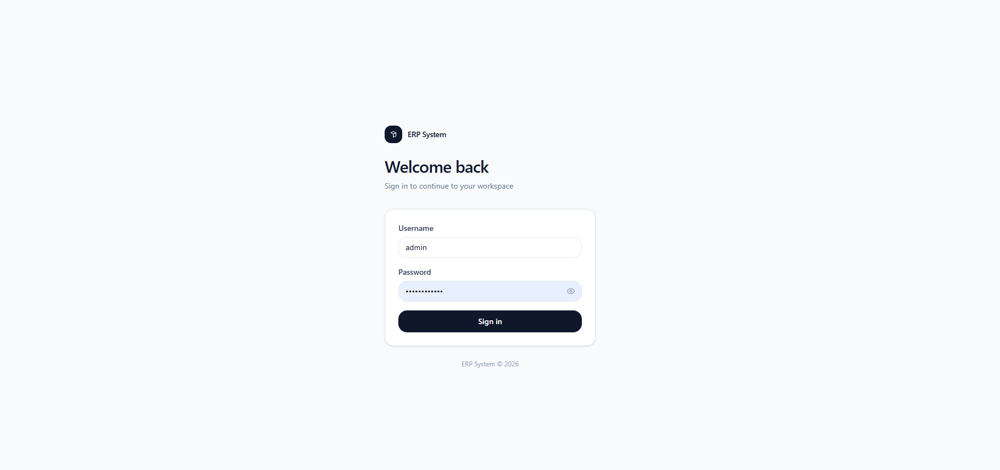
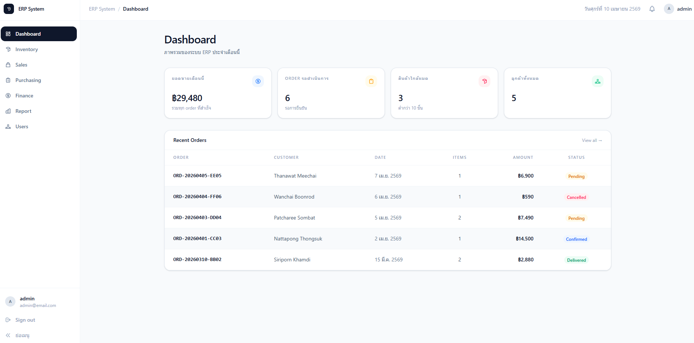
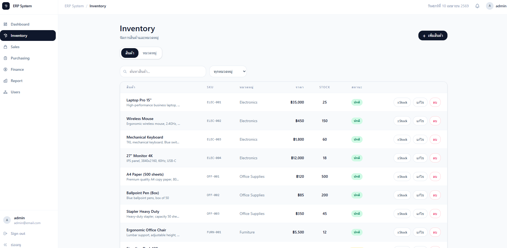
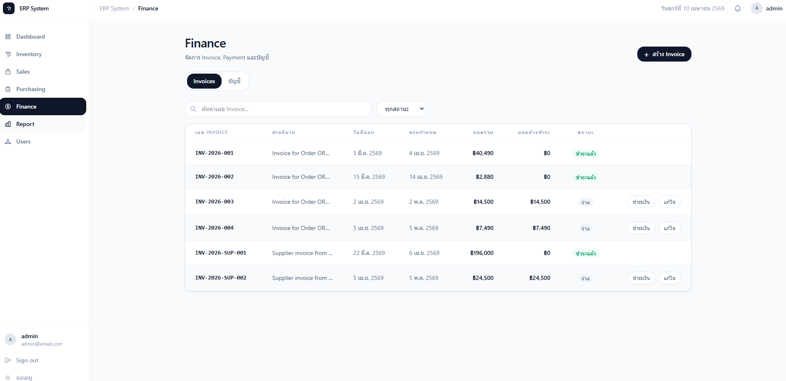
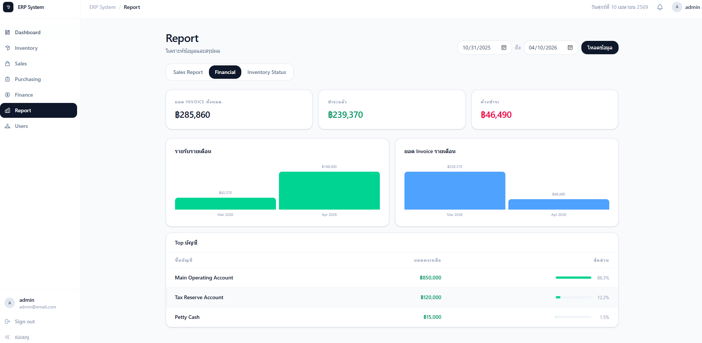

# ERP System

[](https://erp-system-ten-iota.vercel.app/)
[](https://erp-system-wsyi.onrender.com)

A full-stack Enterprise Resource Planning (ERP) web application built with **ASP.NET Core 9** and **Vue 3**. This project demonstrates modular clean architecture, JWT authentication with refresh tokens, and multi-domain business logic across six core business modules.

---

## Features

- **Identity & Access Control** — manage user accounts, assign roles (Admin, Manager, User), and handle secure authentication with JWT and Refresh Tokens
- **Sales** — manage customers, create and track orders, update order status
- **Inventory** — manage products and categories, track stock levels with low-stock alerts
- **Purchasing** — manage suppliers, create and approve purchase orders
- **Finance** — manage accounts, create invoices, record payments
- **Report & Dashboard** — financial summary, sales overview, inventory status with interactive chart data
- **Quality Assurance** — comprehensive unit tests covering core business logic using xUnit and Moq

---

## Architecture

This project follows **Modular Monolith** with **Clean Architecture** principles. Each business domain is structured as an independent module with its own layers:

```
backend/src/Modules/{Module}/
├── {Module}.Domain          → Entities, enums, business rules (no dependencies)
├── {Module}.Application     → DTOs, service interfaces, repository interfaces, business logic
├── {Module}.Infrastructure  → DbContext, EF Core migrations, repository implementations
```

**Shared infrastructure** (GenericRepository, UnitOfWork, exception middleware, BaseEntity) lives in `ERP.Shared.*` and is reused across all modules to avoid code duplication.

**Presentation layer** (`ERP.Api`) is a single ASP.NET Core project that wires all modules together via dependency injection in `Program.cs`, with centralized CORS, authentication, and Swagger configuration.

### Design Patterns Used

- **Repository Pattern + Unit of Work** — abstracts data access and ensures transactional consistency
- **Dependency Injection** — built-in .NET DI container for loose coupling
- **DTO Pattern** — data transfer objects prevent entity exposure and decouple layers
- **Generic Repository** — reusable CRUD operations with typed constraints
- **Service Layer Pattern** — encapsulates business logic separate from controllers
- **Middleware Pattern** — custom exception handling for consistent API error responses

---

## Tech Stack

### Backend

|                  |                                 |
| ---------------- | ------------------------------- |
| Runtime          | .NET 9 / ASP.NET Core           |
| ORM              | Entity Framework Core 9         |
| Database         | PostgreSQL                      |
| Authentication   | JWT Bearer + Refresh Token      |
| API Docs         | Swagger / OpenAPI (Swashbuckle) |
| Testing          | xUnit + Moq                     |
| Containerization | Docker support                  |

### Frontend

|                  |                         |
| ---------------- | ----------------------- |
| Framework        | Vue 3 (Composition API) |
| Language         | TypeScript              |
| State Management | Pinia                   |
| Routing          | Vue Router              |
| Styling          | Tailwind CSS v4         |
| HTTP Client      | Axios                   |
| Build Tool       | Vite                    |
| UI Language      | Thai (TH)               |

---

## Getting Started

### Prerequisites

- [.NET 9 SDK](https://dotnet.microsoft.com/download)
- [Node.js](https://nodejs.org/) v20 or v22+
- [PostgreSQL](https://www.postgresql.org/download/) 12+ (or Docker)

### 1. Clone the repository

```bash
git clone https://github.com/chinkoike/erp-system.git
cd erp-system
```

### 2. Configure the database

Update the connection string in `backend/src/Presentation/ERP.Api/appsettings.Development.json`:

```json
{
  "ConnectionStrings": {
    "DefaultConnection": "Host=localhost;Port=5432;Database=ERPSystem;Username=postgres;Password=your_password"
  },
  "Jwt": {
    "Secret": "your-super-secret-key-min-32-chars",
    "Issuer": "ERPSystem",
    "Audience": "ERPSystemClient",
    "AccessTokenExpiryMinutes": 60,
    "RefreshTokenExpiryDays": 7
  }
}
```

**Note:** Replace `your_password` and `your-super-secret-key-min-32-chars` with secure values.

### 3. Run database migrations

Navigate to the backend directory and run migrations for each module:

```bash
cd backend

# Identity module
dotnet ef database update --project src/Modules/Identity/ERP.Identity.Infrastructure --startup-project src/Presentation/ERP.Api

# Inventory module
dotnet ef database update --project src/Modules/Inventory/ERP.Inventory.Infrastructure --startup-project src/Presentation/ERP.Api

# Sales module
dotnet ef database update --project src/Modules/Sales/ERP.Sales.Infrastructure --startup-project src/Presentation/ERP.Api

# Purchasing module
dotnet ef database update --project src/Modules/Purchasing/ERP.Purchasing.Infrastructure --startup-project src/Presentation/ERP.Api

# Finance module
dotnet ef database update --project src/Modules/Finance/ERP.Finance.Infrastructure --startup-project src/Presentation/ERP.Api
```

**Alternative:** Run all migrations at once using the convenience script (if provided) or apply them individually as shown above.

### 4. Run the backend

```bash
cd backend
dotnet run --project src/Presentation/ERP.Api
```

API will be available at `http://localhost:5049`  
Swagger UI: `http://localhost:5049/swagger`

### 5. Configure and run the frontend

Update the API base URL in `frontend/src/services/api.ts` if needed (default is `http://localhost:5049`).

```bash
cd frontend
npm install
npm run dev
```

Frontend will be available at `http://localhost:5173`

### 6. Initial Login

Use these default credentials to log in:

- **Username:** admin
- **Password:** Password123!

(These should be created via database seed or initial migration)

---

## 📸 Screenshots

<details>
  <summary>Click to expand screenshots</summary>

### 🔐 Authentication & Security

_Login page with JWT integration_


### 📊 Business Intelligence

_Main dashboard featuring real-time data visualization_


### 📦 Core Modules

| Inventory Management                   | Financial Tracking                 |
| -------------------------------------- | ---------------------------------- |
|  |  |

### 📑 Reporting System

_Comprehensive business reports_


</details>

---

## Docker Support

The backend includes a Dockerfile for containerization. To run the entire stack with Docker Compose:

```bash
docker-compose up -d
```

This will start:

- PostgreSQL database
- Backend API
- Frontend (if configured)

---

## Testing

This project uses **xUnit** for unit testing and **Moq** for dependency mocking. The tests cover business logic across all modules:

- **Finance Module** — Account, Invoice, Payment operations
- **Inventory Module** — Product and Category CRUD, stock updates
- **Purchasing Module** — Supplier management, Purchase Order workflows
- **Sales Module** — Customer and Order management

To run the tests:

```bash
cd backend
dotnet test ERP.Tests/ERP.Tests.csproj
```

Test coverage includes:

- Service layer business logic
- Repository pattern implementations
- DTO validations
- Exception handling scenarios

---

## API Overview

All endpoints are documented via Swagger UI at `/swagger`. Authentication uses **JWT Bearer tokens**.

### Authentication Flow

1. POST `/api/auth/login` — returns access token + refresh token
2. Include `Authorization: Bearer {token}` in subsequent requests
3. POST `/api/auth/refresh` — get new access token using refresh token
4. POST `/api/auth/logout` — invalidate refresh token

### Module Endpoints

| Module     | Base Route                              | Key Endpoints                                        |
| ---------- | --------------------------------------- | ---------------------------------------------------- |
| Identity   | `/api/users`, `/api/roles`, `/api/auth` | Login, Register, Refresh Token, User/Role Management |
| Sales      | `/api/orders`, `/api/customers`         | Create Order, Update Order Status, Customer CRUD     |
| Inventory  | `/api/products`, `/api/categories`      | Product CRUD, Category Management, Stock Updates     |
| Purchasing | `/api/purchasing`                       | Supplier CRUD, Purchase Order Management             |
| Finance    | `/api/finance`                          | Account Management, Invoice/Payment Processing       |
| Report     | `/api/report`                           | Financial Summary, Sales Reports, Inventory Status   |
| Dashboard  | `/api/dashboard`                        | Aggregated Business Metrics and Charts               |

---

## Project Structure

```
erp-system/
├── backend/
│   ├── ERP.Tests/                          ← Unit tests
│   │   ├── Finance/
│   │   ├── Inventory/
│   │   ├── Purchasing/
│   │   └── Sales/
│   └── src/
│       ├── Modules/
│       │   ├── Finance/
│       │   │   ├── ERP.Finance.Domain
│       │   │   ├── ERP.Finance.Application
│       │   │   └── ERP.Finance.Infrastructure
│       │   ├── Identity/
│       │   │   ├── ERP.Identity.Domain
│       │   │   ├── ERP.Identity.Application
│       │   │   └── ERP.Identity.Infrastructure
│       │   ├── Inventory/
│       │   │   ├── ERP.Inventory.Domain
│       │   │   ├── ERP.Inventory.Application
│       │   │   └── ERP.Inventory.Infrastructure
│       │   ├── Purchasing/
│       │   │   ├── ERP.Purchasing.Domain
│       │   │   ├── ERP.Purchasing.Application
│       │   │   └── ERP.Purchasing.Infrastructure
│       │   ├── Report/
│       │   │   ├── ERP.Report.Application
│       │   │   └── ERP.Report.Infrastructure
│       │   └── Sales/
│       │       ├── ERP.Sales.Domain
│       │       ├── ERP.Sales.Application
│       │       └── ERP.Sales.Infrastructure
│       ├── Presentation/
│       │   └── ERP.Api/                    ← Entry point, DI configuration
│       │       ├── Controllers/
│       │       ├── Middleware/
│       │       └── Program.cs
│       └── Shared/
│           ├── ERP.Shared/                 ← Common interfaces, base entities
│           └── ERP.Shared.Infrastructure/  ← GenericRepository, UnitOfWork
└── frontend/
    └── src/
        ├── components/                     ← Reusable UI components
        ├── layouts/
        │   └── AppLayout.vue               ← Main layout with sidebar
        ├── views/                          ← Page components
        │   ├── DashboardView.vue
        │   ├── InventoryView.vue
        │   ├── SalesView.vue
        │   ├── PurchasingView.vue
        │   ├── FinanceView.vue
        │   ├── ReportView.vue
        │   └── UsersView.vue
        ├── stores/                         ← Pinia state management
        │   ├── authStore.ts
        │   ├── inventoryStore.ts
        │   ├── salesStore.ts
        │   ├── purchasingStore.ts
        │   ├── financeStore.ts
        │   └── dashboardStore.ts
        ├── services/                       ← API clients
        │   ├── api.ts
        │   └── authService.ts
        ├── types/                          ← TypeScript interfaces
        └── router/
            └── index.ts                    ← Route definitions + guards
```

---

## Key Features & Implementation Details

### Authentication & Authorization

- JWT-based authentication with access + refresh token pattern
- Role-based access control (RBAC) with Admin, Manager, User roles
- Route guards in Vue Router enforcing role permissions
- Automatic token refresh on expiry
- Secure logout with token invalidation

### Data Validation

- Server-side validation using Data Annotations
- Client-side validation using TypeScript types
- Consistent error response format across all endpoints

### Error Handling

- Custom exception middleware in ASP.NET Core
- Centralized error logging
- User-friendly error messages in Thai language (frontend)

### Database Design

- Separate PostgreSQL schemas per module for data isolation
- EF Core migrations per module
- Foreign key relationships enforced at database level
- Audit fields (CreatedAt, UpdatedAt) on all entities via BaseEntity

### Frontend Architecture

- Composition API with `<script setup>` syntax
- Centralized state management using Pinia stores
- Axios interceptors for auth token injection
- Responsive design with Tailwind CSS
- Component reusability and code organization

---

## Development Guidelines

### Adding a New Module

1. Create three projects in `backend/src/Modules/{ModuleName}/`:
   - `{ModuleName}.Domain` — entities and enums
   - `{ModuleName}.Application` — services, DTOs, interfaces
   - `{ModuleName}.Infrastructure` — DbContext, repositories

2. Register module services in `ERP.Api/Program.cs`

3. Create migration and update database

4. Add corresponding API controllers in `ERP.Api/Controllers/`

5. Create frontend views, stores, and services

### Code Standards

- Follow C# naming conventions (PascalCase for public members)
- Use async/await for all I/O operations
- Keep controllers thin — business logic belongs in services
- Write unit tests for new business logic
- Use DTOs for all API responses (never expose entities directly)

---

## Future Enhancements

- [ ] Add real-time notifications using SignalR
- [ ] Implement audit logging for all data changes
- [ ] Add data export functionality (Excel, PDF)
- [ ] Implement advanced search and filtering
- [ ] Add batch operations for inventory management
- [ ] Email notifications for critical events
- [ ] Mobile app using React Native or Flutter
- [ ] Advanced analytics and reporting dashboards
- [ ] Multi-language support (currently Thai only)

---

## License

This project is licensed under the MIT License - see the LICENSE file for details.

---

## Acknowledgments

- Built with ASP.NET Core and Vue.js
- Uses Entity Framework Core for data access
- UI components inspired by modern dashboard designs
- Tailwind CSS for responsive styling

---
